# DATABASE.md

The complete database schema for ORB. This is the source of truth for data modeling. If code disagrees with this doc, update whichever is wrong.

## Conventions

Every table in this schema follows these rules:

- Primary key is `id: uuid` (generated by Postgres `gen_random_uuid()`)
- Every table has `created_at: timestamptz` and `updated_at: timestamptz`
- Soft deletes use `deleted_at: timestamptz` (nullable). Queries filter `WHERE deleted_at IS NULL` by default.
- Foreign keys use `<entity>_id` naming (e.g., `user_id`, not `userId`). Prisma will camelCase in TypeScript automatically.
- Monetary amounts are stored in cents as `integer` (never floats for money).
- All timestamps are UTC. Timezone handling is a presentation concern, not a data concern.
- Every table that references `users` has Supabase Row Level Security (RLS) enabled with a policy that restricts access to `auth.uid() = user_id`.

## Entity relationship diagram

```mermaid
erDiagram
  users ||--o{ subscriptions : has
  users ||--o{ phone_numbers : has
  users ||--|| agent_context : has
  users ||--o{ connected_accounts : has
  users ||--o{ content_drafts : has
  users ||--o{ content_posts : has
  users ||--o{ messages : receives
  users ||--o{ calls : receives
  users ||--o{ appointments : has
  users ||--o{ competitors : tracks
  users ||--o{ findings : receives
  users ||--o{ agent_events : produces

  users {
    uuid id PK
    string phone
    string email
    string business_description
    string goal
    string brand_voice
    timestamptz onboarded_at
    timestamptz trial_ends_at
    timestamptz created_at
  }

  subscriptions {
    uuid id PK
    uuid user_id FK
    string stripe_customer_id
    string stripe_subscription_id
    string plan
    string status
    timestamptz current_period_end
  }

  phone_numbers {
    uuid id PK
    uuid user_id FK
    string number
    string twilio_sid
    string status
    timestamptz released_at
  }

  agent_context {
    uuid user_id PK,FK
    jsonb strategist_output
    jsonb scout_watching
    jsonb pulse_signals
    jsonb voice_fingerprint
    timestamptz last_refreshed_at
  }

  connected_accounts {
    uuid id PK
    uuid user_id FK
    string provider
    string external_id
    string encrypted_token
    timestamptz expires_at
  }

  content_drafts {
    uuid id PK
    uuid user_id FK
    string platform
    string status
    jsonb content
    timestamptz scheduled_for
  }

  content_posts {
    uuid id PK
    uuid user_id FK
    uuid draft_id FK
    string platform
    string external_id
    jsonb metrics
    timestamptz published_at
  }

  messages {
    uuid id PK
    uuid user_id FK
    string channel
    string from_address
    string direction
    string body
    string handled_by
  }

  calls {
    uuid id PK
    uuid user_id FK
    string from_number
    int duration_seconds
    string transcript_url
    jsonb extracted_intent
    timestamptz started_at
  }

  appointments {
    uuid id PK
    uuid user_id FK
    uuid call_id FK
    string customer_name
    timestamptz scheduled_for
    int estimated_value_cents
    string status
  }

  competitors {
    uuid id PK
    uuid user_id FK
    string name
    string handle
    string platform
    jsonb recent_activity
  }

  findings {
    uuid id PK
    uuid user_id FK
    string agent
    string severity
    string summary
    jsonb payload
    boolean acknowledged
  }

  agent_events {
    uuid id PK
    uuid user_id FK
    string agent
    string event_type
    jsonb payload
    timestamptz created_at
  }
```



## The schema (Prisma)

This is the canonical `schema.prisma`. Paste this file directly into `packages/db/prisma/schema.prisma` when scaffolding.

```prisma
generator client {
  provider = "prisma-client-js"
  previewFeatures = ["driverAdapters"]
}

datasource db {
  provider = "postgresql"
  url      = env("DATABASE_URL")
  directUrl = env("DIRECT_URL")
}

// =============================================================
// Users — the core identity table (backed by Supabase auth)
// =============================================================
model User {
  id                    String    @id @default(uuid()) @db.Uuid
  phone                 String?   @unique
  email                 String?   @unique
  businessDescription   String?   @map("business_description")
  goal                  Goal?
  brandVoice            Json?     @map("brand_voice")
  onboardedAt           DateTime? @map("onboarded_at")
  trialEndsAt           DateTime? @map("trial_ends_at")
  createdAt             DateTime  @default(now()) @map("created_at")
  updatedAt             DateTime  @updatedAt @map("updated_at")
  deletedAt             DateTime? @map("deleted_at")

  subscriptions         Subscription[]
  phoneNumbers          PhoneNumber[]
  agentContext          AgentContext?
  connectedAccounts     ConnectedAccount[]
  contentDrafts         ContentDraft[]
  contentPosts          ContentPost[]
  messages              Message[]
  calls                 Call[]
  appointments          Appointment[]
  competitors           Competitor[]
  findings              Finding[]
  agentEvents           AgentEvent[]

  @@map("users")
}

enum Goal {
  MORE_CUSTOMERS
  MORE_REPEAT_BUYERS
  MORE_VISIBILITY
}

// =============================================================
// Subscriptions — Stripe billing state mirrored into our DB
// =============================================================
model Subscription {
  id                     String             @id @default(uuid()) @db.Uuid
  userId                 String             @map("user_id") @db.Uuid
  stripeCustomerId       String             @map("stripe_customer_id")
  stripeSubscriptionId   String             @unique @map("stripe_subscription_id")
  plan                   Plan
  status                 SubscriptionStatus
  currentPeriodEnd       DateTime           @map("current_period_end")
  cancelAtPeriodEnd      Boolean            @default(false) @map("cancel_at_period_end")
  createdAt              DateTime           @default(now()) @map("created_at")
  updatedAt              DateTime           @updatedAt @map("updated_at")

  user                   User               @relation(fields: [userId], references: [id])

  @@index([userId])
  @@index([stripeCustomerId])
  @@map("subscriptions")
}

enum Plan {
  SOLO
  TEAM
  STUDIO
}

enum SubscriptionStatus {
  TRIALING
  ACTIVE
  PAST_DUE
  CANCELED
  UNPAID
}

// =============================================================
// PhoneNumbers — the ORB number assigned to each user
// =============================================================
model PhoneNumber {
  id           String              @id @default(uuid()) @db.Uuid
  userId       String              @map("user_id") @db.Uuid
  number       String              @unique
  twilioSid    String              @unique @map("twilio_sid")
  status       PhoneNumberStatus   @default(ACTIVE)
  releasedAt   DateTime?           @map("released_at")
  createdAt    DateTime            @default(now()) @map("created_at")

  user         User                @relation(fields: [userId], references: [id])

  @@map("phone_numbers")
}

enum PhoneNumberStatus {
  ACTIVE
  SUSPENDED
  RELEASED
}

// =============================================================
// AgentContext — per-user memory shared across all 6 agents
// =============================================================
model AgentContext {
  userId             String    @id @map("user_id") @db.Uuid
  strategistOutput   Json?     @map("strategist_output")
  scoutWatching      Json?     @map("scout_watching")
  pulseSignals       Json?     @map("pulse_signals")
  voiceFingerprint   Json?     @map("voice_fingerprint")
  lastRefreshedAt    DateTime? @map("last_refreshed_at")
  createdAt          DateTime  @default(now()) @map("created_at")
  updatedAt          DateTime  @updatedAt @map("updated_at")

  user               User      @relation(fields: [userId], references: [id])

  @@map("agent_context")
}

// =============================================================
// ConnectedAccounts — OAuth connections (Instagram, etc.)
// =============================================================
model ConnectedAccount {
  id               String            @id @default(uuid()) @db.Uuid
  userId           String            @map("user_id") @db.Uuid
  provider         Provider
  externalId       String            @map("external_id")
  encryptedToken   String            @map("encrypted_token")
  encryptedRefresh String?           @map("encrypted_refresh")
  scope            String?
  expiresAt        DateTime?         @map("expires_at")
  disconnectedAt   DateTime?         @map("disconnected_at")
  createdAt        DateTime          @default(now()) @map("created_at")
  updatedAt        DateTime          @updatedAt @map("updated_at")

  user             User              @relation(fields: [userId], references: [id])

  @@unique([userId, provider])
  @@map("connected_accounts")
}

enum Provider {
  INSTAGRAM
  FACEBOOK
  LINKEDIN
  GOOGLE_CALENDAR
}

// =============================================================
// ContentDrafts — Echo's output before publishing
// =============================================================
model ContentDraft {
  id             String         @id @default(uuid()) @db.Uuid
  userId         String         @map("user_id") @db.Uuid
  platform       Platform
  status         DraftStatus    @default(DRAFT)
  content        Json           // { caption, slides?, hashtags, media_refs }
  scheduledFor   DateTime?      @map("scheduled_for")
  voiceMatchScore Decimal?      @map("voice_match_score") @db.Decimal(4, 3)
  approvedAt     DateTime?      @map("approved_at")
  rejectedAt     DateTime?      @map("rejected_at")
  rejectionReason String?       @map("rejection_reason")
  createdAt      DateTime       @default(now()) @map("created_at")
  updatedAt      DateTime       @updatedAt @map("updated_at")

  user           User           @relation(fields: [userId], references: [id])
  posts          ContentPost[]

  @@index([userId, status])
  @@index([scheduledFor])
  @@map("content_drafts")
}

enum Platform {
  INSTAGRAM
  FACEBOOK
  LINKEDIN
  EMAIL
  PINTEREST
}

enum DraftStatus {
  DRAFT
  AWAITING_PHOTOS
  AWAITING_REVIEW
  APPROVED
  REJECTED
  PUBLISHED
  FAILED
}

// =============================================================
// ContentPosts — actually published content + metrics
// =============================================================
model ContentPost {
  id           String       @id @default(uuid()) @db.Uuid
  userId       String       @map("user_id") @db.Uuid
  draftId      String       @map("draft_id") @db.Uuid
  platform     Platform
  externalId   String       @map("external_id")
  permalink    String?
  metrics      Json?        // { reach, likes, saves, comments, shares }
  publishedAt  DateTime     @map("published_at")
  createdAt    DateTime     @default(now()) @map("created_at")
  updatedAt    DateTime     @updatedAt @map("updated_at")

  user         User         @relation(fields: [userId], references: [id])
  draft        ContentDraft @relation(fields: [draftId], references: [id])

  @@index([userId, publishedAt])
  @@map("content_posts")
}

// =============================================================
// Messages — unified inbox (SMS, IG DMs, email)
// =============================================================
model Message {
  id            String          @id @default(uuid()) @db.Uuid
  userId        String          @map("user_id") @db.Uuid
  threadId      String          @map("thread_id") @db.Uuid
  channel       MessageChannel
  fromAddress   String          @map("from_address")
  direction     Direction
  body          String          @db.Text
  handledBy     String?         @map("handled_by") // "signal" | "user" | null
  metadata      Json?
  createdAt     DateTime        @default(now()) @map("created_at")

  user          User            @relation(fields: [userId], references: [id])

  @@index([userId, threadId])
  @@index([userId, createdAt])
  @@map("messages")
}

enum MessageChannel {
  SMS
  INSTAGRAM_DM
  EMAIL
}

enum Direction {
  INBOUND
  OUTBOUND
}

// =============================================================
// Calls — Signal's call log
// =============================================================
model Call {
  id                String        @id @default(uuid()) @db.Uuid
  userId            String        @map("user_id") @db.Uuid
  fromNumber        String        @map("from_number")
  durationSeconds   Int           @map("duration_seconds")
  transcriptUrl     String?       @map("transcript_url")
  extractedIntent   Json?         @map("extracted_intent") // { category, summary, value_estimate }
  estimatedValueCents Int?        @map("estimated_value_cents")
  recoveredStatus   CallStatus    @map("recovered_status")
  startedAt         DateTime      @map("started_at")
  createdAt         DateTime      @default(now()) @map("created_at")

  user              User          @relation(fields: [userId], references: [id])
  appointments      Appointment[]

  @@index([userId, startedAt])
  @@map("calls")
}

enum CallStatus {
  MISSED_AND_RECOVERED
  MISSED_NO_RESPONSE
  ANSWERED_BY_SIGNAL
  ANSWERED_BY_USER
}

// =============================================================
// Appointments — bookings made by Signal or user
// =============================================================
model Appointment {
  id                    String              @id @default(uuid()) @db.Uuid
  userId                String              @map("user_id") @db.Uuid
  callId                String?             @map("call_id") @db.Uuid
  customerName          String              @map("customer_name")
  customerPhone         String?             @map("customer_phone")
  customerEmail         String?             @map("customer_email")
  scheduledFor          DateTime            @map("scheduled_for")
  estimatedValueCents   Int?                @map("estimated_value_cents")
  status                AppointmentStatus   @default(CONFIRMED)
  notes                 String?             @db.Text
  externalCalendarId    String?             @map("external_calendar_id")
  createdAt             DateTime            @default(now()) @map("created_at")
  updatedAt             DateTime            @updatedAt @map("updated_at")

  user                  User                @relation(fields: [userId], references: [id])
  call                  Call?               @relation(fields: [callId], references: [id])

  @@index([userId, scheduledFor])
  @@map("appointments")
}

enum AppointmentStatus {
  CONFIRMED
  COMPLETED
  NO_SHOW
  CANCELED
}

// =============================================================
// Competitors — rivals Scout is tracking for this user
// =============================================================
model Competitor {
  id               String    @id @default(uuid()) @db.Uuid
  userId           String    @map("user_id") @db.Uuid
  name             String
  handle           String?
  platform         Platform
  recentActivity   Json?     @map("recent_activity")
  lastCheckedAt    DateTime? @map("last_checked_at")
  createdAt        DateTime  @default(now()) @map("created_at")
  updatedAt        DateTime  @updatedAt @map("updated_at")

  user             User      @relation(fields: [userId], references: [id])

  @@index([userId])
  @@map("competitors")
}

// =============================================================
// Findings — things any agent has surfaced for the user
// =============================================================
model Finding {
  id              String          @id @default(uuid()) @db.Uuid
  userId          String          @map("user_id") @db.Uuid
  agent           Agent
  severity        FindingSeverity
  summary         String          @db.Text
  payload         Json?
  acknowledged    Boolean         @default(false)
  acknowledgedAt  DateTime?       @map("acknowledged_at")
  createdAt       DateTime        @default(now()) @map("created_at")

  user            User            @relation(fields: [userId], references: [id])

  @@index([userId, acknowledged])
  @@index([userId, createdAt])
  @@map("findings")
}

enum Agent {
  STRATEGIST
  SCOUT
  PULSE
  ADS
  ECHO
  SIGNAL
}

enum FindingSeverity {
  INFO
  NEEDS_ATTENTION
  URGENT
}

// =============================================================
// AgentEvents — append-only log of agent activity
// =============================================================
model AgentEvent {
  id           String     @id @default(uuid()) @db.Uuid
  userId       String     @map("user_id") @db.Uuid
  agent        Agent
  eventType    String     @map("event_type")
  payload      Json?
  createdAt    DateTime   @default(now()) @map("created_at")

  user         User       @relation(fields: [userId], references: [id])

  @@index([userId, createdAt])
  @@index([agent, createdAt])
  @@map("agent_events")
}
```

## Row Level Security policies

Every user-owned table gets an RLS policy that restricts rows to the authenticated user. Paste these into a migration after the initial schema:

```sql
-- Enable RLS on all user-owned tables
alter table users enable row level security;
alter table subscriptions enable row level security;
alter table phone_numbers enable row level security;
alter table agent_context enable row level security;
alter table connected_accounts enable row level security;
alter table content_drafts enable row level security;
alter table content_posts enable row level security;
alter table messages enable row level security;
alter table calls enable row level security;
alter table appointments enable row level security;
alter table competitors enable row level security;
alter table findings enable row level security;
alter table agent_events enable row level security;

-- Users can only read/write their own row
create policy "users_self_access" on users
  for all using (auth.uid() = id);

-- All user-owned tables: user_id must match auth.uid()
create policy "subscriptions_user_access" on subscriptions
  for all using (auth.uid() = user_id);

create policy "phone_numbers_user_access" on phone_numbers
  for all using (auth.uid() = user_id);

create policy "agent_context_user_access" on agent_context
  for all using (auth.uid() = user_id);

create policy "connected_accounts_user_access" on connected_accounts
  for all using (auth.uid() = user_id);

create policy "content_drafts_user_access" on content_drafts
  for all using (auth.uid() = user_id);

create policy "content_posts_user_access" on content_posts
  for all using (auth.uid() = user_id);

create policy "messages_user_access" on messages
  for all using (auth.uid() = user_id);

create policy "calls_user_access" on calls
  for all using (auth.uid() = user_id);

create policy "appointments_user_access" on appointments
  for all using (auth.uid() = user_id);

create policy "competitors_user_access" on competitors
  for all using (auth.uid() = user_id);

create policy "findings_user_access" on findings
  for all using (auth.uid() = user_id);

create policy "agent_events_user_access" on agent_events
  for all using (auth.uid() = user_id);
```

Service role (used by backend) bypasses RLS automatically. Client queries from the mobile app go through tRPC, which uses the service role but explicitly filters by `userId` from the authenticated session — this gives us both RLS (defense in depth) and explicit filtering (clear intent).

## Indexes worth calling out

Most indexes are defined inline in the Prisma schema above. A few are worth explaining:

- `content_drafts(user_id, status)` — the home screen queries "drafts needing attention" constantly. Without this index, each home load scans the whole table.
- `content_drafts(scheduled_for)` — the pg_cron job that publishes scheduled posts filters on this. Global index (not per-user) because cron runs across all users.
- `messages(user_id, thread_id)` — thread detail views load all messages in a thread.
- `findings(user_id, acknowledged)` — the home amber card queries unacknowledged findings. Must be fast.

## Migrations

### Initial migration

The first migration creates all tables from the schema above. Generate it:

```bash
cd packages/db
npx prisma migrate dev --name init
```

### Ongoing migrations

Rules:

1. **Never edit an applied migration.** Create a new one.
2. **Name migrations descriptively.** `add_appointment_external_calendar_id`, not `update_schema`.
3. **Test migrations on a dev database before production.** Prisma's `migrate deploy` in CI.
4. **Include data migrations with schema migrations when needed.** Use raw SQL in the migration file if Prisma can't express it.
5. **Backward-compatible migrations only for multi-step deploys.** If you're dropping a column, first deploy code that doesn't reference it, then drop in a second migration.

## Seeding dev data

`packages/db/prisma/seed.ts` creates a consistent test user matching the prototype:

- One user: `maya@ceramicsco.example` with a `+1 (416) 555-0172` ORB number
- One active subscription (trialing, day 3)
- Three content drafts in various states
- Two competitors (East Fork, Heath)
- A handful of calls/messages/appointments

Run with `pnpm db:seed`. Safe to run multiple times (uses upserts).

## Queries you'll write a lot

Reference patterns for common queries. These go in your tRPC procedures.

### Get current user with subscription

```ts
const user = await prisma.user.findUnique({
  where: { id: userId },
  include: { subscriptions: { where: { status: { in: ['TRIALING', 'ACTIVE'] } } } }
});
```

### Get home screen data

```ts
const [user, pendingFindings, recentActivity] = await Promise.all([
  prisma.user.findUnique({ where: { id: userId } }),
  prisma.finding.findMany({
    where: { userId, acknowledged: false },
    orderBy: { createdAt: 'desc' },
    take: 1
  }),
  prisma.agentEvent.findMany({
    where: { userId, createdAt: { gte: sevenDaysAgo } },
    orderBy: { createdAt: 'desc' },
    take: 20
  })
]);
```

### Insert agent event (append-only log pattern)

```ts
await prisma.agentEvent.create({
  data: {
    userId,
    agent: 'SIGNAL',
    eventType: 'call_handled',
    payload: { callId, intent, valueEstimate }
  }
});
```

## What's not in the schema (and why)

- **Invoices table** — Stripe is source of truth. We just link via `stripeSubscriptionId`.
- **Audit log table** — we use `agent_events` as the immutable log. If we ever need user-action logs separately, add `user_events` later.
- **File metadata table** — Supabase Storage has its own metadata. We store references (URLs) in JSON fields, not a separate table.
- **Sessions table** — Supabase Auth manages this.
- **Teams / organizations** — ORB is single-user per account for v1. Adding multi-user requires a migration; that's fine.
